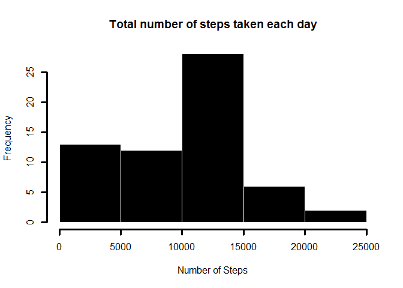
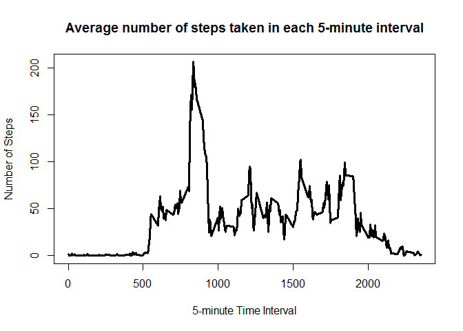
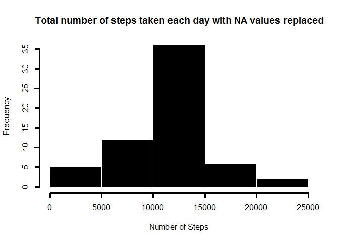

# Reproducible Research: Peer Assessment 1


## Loading and preprocessing the data
Navigate to the folder where the data for this assignment resides.

```r
setwd("C:\\Users\\asl\\Desktop\\MOOC\\Class 5")
data = read.csv("activity.csv")
```

Data overview 


```r
head(data)
```

```
##   steps       date interval
## 1    NA 2012-10-01        0
## 2    NA 2012-10-01        5
## 3    NA 2012-10-01       10
## 4    NA 2012-10-01       15
## 5    NA 2012-10-01       20
## 6    NA 2012-10-01       25
```

## What is mean total number of steps taken per day?


```r
steps_mean <- aggregate(data$steps, by=list(data$date), FUN=sum, na.rm=TRUE)
```

Making a histogram of the total number of steps taken each day


```r
names(steps_mean) = c("date", "total")

hist(steps_mean$total, 
     main ="Total number of steps taken each day", 
     xlab ="Number of Steps", 
     ylab ="Frequency",
     border="white", 
     col="black", 
     lwd=3
     )
```

 

Calculating the mean of the total number of steps taken per day

```r
mean(steps_mean$total)
```

```
## [1] 9354.23
```
Calculating the median of the total number of steps taken per day

```r
median(steps_mean$total)
```

```
## [1] 10395
```


## What is the average daily activity pattern?

Make a time series plot (i.e. type = "l") of the 5-minute interval (x-axis) and the average number of steps taken, averaged across all days (y-axis)


```r
interval_mean = aggregate(data$steps,  by=list(data$interval), FUN=mean, na.rm=TRUE)

names(interval_mean) = c("interval" , "mean")

plot(interval_mean$interval, 
     interval_mean$mean, 
     type="l", 
     main='Average number of steps taken in each 5-minute interval',
     xlab ="5-minute Time Interval", 
     ylab ="Number of Steps",
     col="black",
     lwd=3
)
```

 

Which 5-minute interval, on average across all the days in the dataset, contains the maximum number of steps?

On average , most steps are registerd in the time interval of ***835*** .


## Imputing missing values

Note that there are a number of days/intervals where there are missing values (coded as NA). The presence of missing days may introduce bias into some calculations or summaries of the data.

Calculate and report the total number of missing values in the dataset (i.e. the total number of rows with NAs)


```r
sum(is.na(data$steps))
```

There are ***2304*** missing values in the dataset.

Devise a strategy for filling in all of the missing values in the dataset. The strategy does not need to be sophisticated. For example, you could use the mean/median for that day, or the mean for that 5-minute interval, etc.

Create a new dataset that is equal to the original dataset but with the missing data filled in.

**Strategy used is to replace all NA values with the mean number of steps for e day.**


```r
# Find the missing values positions
missing_data = which(is.na(data$steps))

rep_mean = rep( mean(data$steps, na.rm=TRUE), times=length(missing_data))

# Create a new copy of original data to use for imputing values
impute_data = data

impute_data[missing_data, "steps"] = rep_mean
```

Make a histogram of the total number of steps taken each day 


```r
steps_mean2 <- aggregate(impute_data$steps, by=list(impute_data$date), FUN=sum, na.rm=TRUE)

names(steps_mean2) = c("date", "total")

hist(steps_mean2$total, 
     main ="Total number of steps taken each day with NA values replaced", 
     xlab ="Number of Steps", 
     ylab ="Frequency",
     border="white", 
     col="black", 
     lwd=3
     )
```

 

Calculating the mean of the total number of steps taken per day

```r
mean(steps_mean2$total)
```

```
## [1] 10766.19
```
Calculating the median of the total number of steps taken per day

```r
median(steps_mean2$total)
```

```
## [1] 10766.19
```

Do these values differ from the estimates from the first part of the assignment? What is the impact of imputing missing data on the estimates of the total daily number of steps?

```r
summary_original   = rbind(mean(steps_mean2$total),median(steps_mean2$total))
summary_fixed_data = rbind(mean(steps_mean$total),median(steps_mean$total))
summary = cbind(summary_original, summary_fixed_data)
rownames(summary) = c("Mean", "Median")
colnames(summary) = c("NA Replacement","Original")
print(summary)
```

```
##        NA Replacement Original
## Mean         10766.19  9354.23
## Median       10766.19 10395.00
```
As seen from the table above, an increase in both mean and median is observed.

## Are there differences in activity patterns between weekdays and weekends?


```r
data$weekofday = format(as.Date(data$date),"%w")
data$weekofday[data$weekofday > 0 & data$weekofday < 6] = "weekday"
data$weekofday[data$weekofday == 6 | data$weekofday == 0] = "weekend"

dayofweek_data = aggregate(data$steps, 
                           by=list(data$weekofday, data$interval), 
                           FUN = mean,
                           na.rm=TRUE)

names(dayofweek_data) = c("weekofday","interval","steps")

library(lattice)

xyplot(steps ~ interval | weekofday, dayofweek_data, 
       type="l", 
       lwd=1, 
       xlab="Interval", 
       ylab="Number of steps", 
       layout=c(1,2))
```

 

It can be observed that more step are taken during e weekend then e weekday.

